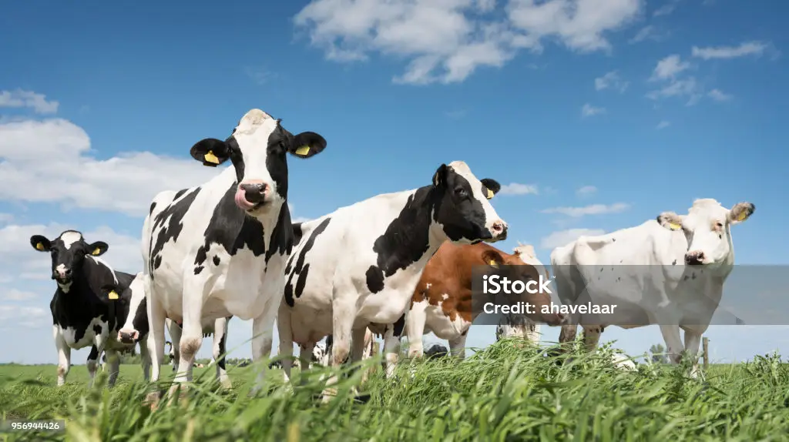

Domestic animals have been an integral part of human civilization for millennia, serving multifaceted roles that extend beyond mere companionship. From the loyal dog by our side to the diligent oxen tilling our fields, domestic animals have played crucial roles in shaping human societies and have significantly contributed to our well-being. This essay explores the importance of domestic animals in various aspects of human life, including companionship, agriculture, economy, and emotional well-being.

Companionship and Emotional Support:
One of the most evident and cherished roles of domestic animals is their companionship and provision of emotional support to humans. From the ancient times when dogs were first domesticated to modern-day therapy animals, the bond between humans and animals has been profound. Pets, such as dogs, cats, and even smaller animals like rabbits and guinea pigs, provide unconditional love, companionship, and emotional solace to their human counterparts. Studies have shown that interacting with pets can reduce stress, anxiety, and depression, while also promoting physical well-being through activities like walking and playing.

Agricultural Contributions:
Domestic animals have been indispensable in agricultural activities since the dawn of agriculture itself. Animals like cattle, horses, and water buffalo have been used for plowing fields, transporting goods, and providing essential labor in farming. Without domesticated animals, the agricultural revolution that transformed human societies and enabled the development of settled civilizations would not have been possible. Even today, in many parts of the world, particularly in rural areas, animals continue to play a vital role in sustaining agricultural livelihoods.
