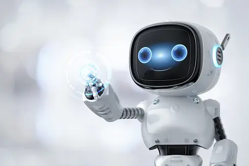

Artificial Intelligence (AI) has emerged as one of the most transformative technologies of the 21st century, with profound implications for virtually every aspect of human society. As we look to the future, the trajectory of AI development promises both unprecedented opportunities and challenges. From revolutionizing industries to reshaping the way we live and work, the future of AI holds immense potential to drive innovation, enhance productivity, and improve quality of life.

One of the most promising aspects of the future of AI lies in its ability to revolutionize various industries and sectors. In healthcare, AI-powered diagnostic tools and personalized treatment recommendations have the potential to revolutionize patient care, leading to more accurate diagnoses, targeted therapies, and improved outcomes. Similarly, in transportation, AI-driven autonomous vehicles could redefine mobility, making transportation safer, more efficient, and environmentally sustainable.

Moreover, AI is poised to transform the workplace by automating routine tasks, augmenting human capabilities, and enabling new forms of collaboration between humans and machines. While this may raise concerns about job displacement and workforce disruption, it also presents opportunities for upskilling, reskilling, and the creation of new job roles centered around AI development, implementation, and oversight.

However, the future of AI also poses significant challenges and ethical considerations that must be addressed. As AI systems become more sophisticated and autonomous, questions surrounding accountability, transparency, and bias emerge. Ensuring the responsible and ethical use of AI requires robust governance frameworks, regulations, and ethical guidelines to mitigate risks and safeguard against unintended consequences, such as algorithmic bias or the proliferation of misinformation.
