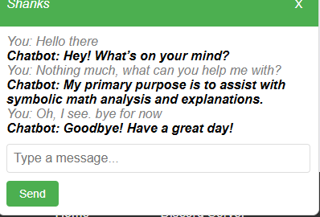

Overview
The Math Chatbot is a context-aware conversational assistant designed to help users solve mathematical problems using natural language input. It integrates with SymPy , a powerful Python library for symbolic mathematics, to provide accurate and detailed solutions to algebraic, calculus, discrete math, and more complex problems.

The bot is ideal for students, educators, and professionals who want to:

Solve equations step-by-step
Understand how to simplify expressions
Learn basic to advanced math concepts interactively
It supports both English and Sesotho (optional), making it accessible to local learners in Lesotho.

Features
✅ Natural Language Input
Users can type questions like "Solve 2x + 5 = 10" or "Integrate x^2 from 0 to 3"

✅ Step-by-Step Explanations
Instead of just giving the final answer, the chatbot explains each step clearly.

✅ Context-Aware Responses
Maintains conversation context to support follow-up questions like "Now differentiate that function"

✅ Supports Multiple Math Domains

Algebra
Calculus
Linear Algebra
Discrete Math
Statistics
✅ Easy Integration
Built with Python, Flask, and SymPy — ready to deploy on web or mobile platforms

Cody structure.
math-chatbot/
├── app.py              # Main chatbot logic
├── sympy_utils.py      # Math processing with SymPy
├── chat_interface.py   # Handles input/output
├── knowledge_base.json # Predefined rules and answers
├── templates/            # HTML templates (for web version)
│   └── index.html
└── README.md           # This file!

Step 3: Open browser or terminal interface
Visit http://localhost:5000 or use command-line interaction.

🧩 Future Enhancements
Add voice recognition and text-to-speech for accessibility
Support for multiple languages (e.g., Sesotho, Zulu)
Mobile app integration using Kivy
Add LaTeX rendering for better equation display
Build a training module for high school students
🙌 Contributing
Feel free to fork this project and submit pull requests. If you have any ideas for improvements, please open an issue and let’s discuss it!

📝 License
MIT License – see LICENSE for details.

Let me know if you'd like me to generate this as a downloadable .md file , or customize it further with:

Screenshots section (you can insert image links later)
A project logo
A command-line demo
Or even integrate it into your GitHub Pages portfolio
