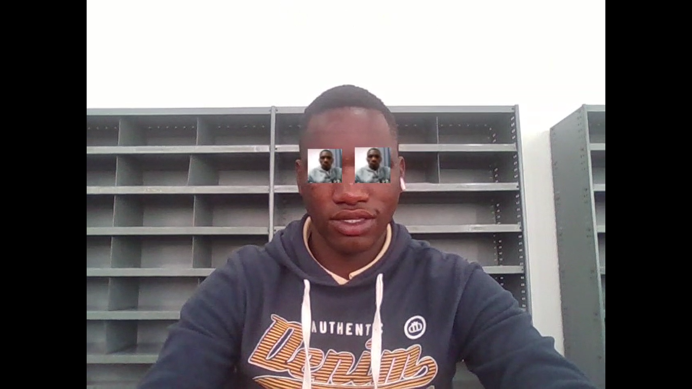

# Face Detector with Eye Overlay Project

## Overview

This project demonstrates an advanced use case of **OpenCV (`cv2`)** for detecting faces and eyes in real-time video streams. Beyond basic face detection, this project overlays custom images (from my portfolio) onto the detected eye regions, creating a playful and interactive effect. It's a great example of combining computer vision techniques with creative visual effects.

---

## Features

- Real-time face detection using Haar Cascade classifiers.
- Precise eye detection within the detected face region.
- Custom image overlay on detected eyes.
- Modular code structure for easy customization and integration.

---

## Tools & Technologies Used

- Python 3.x
- OpenCV (`cv2`)
- Haar Cascade Classifiers:
  - `haarcascade_frontalface_default.xml` for face detection.
  - `haarcascade_eye.xml` for eye detection.
- Optional: `matplotlib`, `numpy` (for image processing/display).

---

## How It Works

The project uses two pre-trained Haar Cascade classifiers to detect faces and eyes:

1. **Face Detection**:
   - The `haarcascade_frontalface_default.xml` classifier detects the entire face region.
   - The detected face region is used as a bounding box for further processing.

2. **Eye Detection**:
   - Within the detected face region, the `haarcascade_eye.xml` classifier identifies the eye areas.
   - These eye regions are then used to overlay custom images.

3. **Image Overlay**:
   - Predefined images from the portfolio are resized and placed over the detected eye regions.
   - The result is displayed in real-time via the webcam feed.

---

## Code Snippet

Here's a simplified version of the code that demonstrates the core functionality:

```python
import cv2

# Load the pre-trained classifiers
face_cascade = cv2.CascadeClassifier(cv2.data.haarcascades + 'haarcascade_frontalface_default.xml')
eye_cascade = cv2.CascadeClassifier(cv2.data.haarcascades + 'haarcascade_eye.xml')

# Read the custom image to overlay on eyes
overlay_image = cv2.imread('portfolio_image.jpg', cv2.IMREAD_UNCHANGED)

# Start capturing video from the webcam
cap = cv2.VideoCapture(0)

while True:
    # Capture frame-by-frame
    ret, frame = cap.read()

    # Convert to grayscale for detection
    gray = cv2.cvtColor(frame, cv2.COLOR_BGR2GRAY)

    # Detect faces
    faces = face_cascade.detectMultiScale(gray, scaleFactor=1.1, minNeighbors=5, minSize=(30, 30))

    for (x, y, w, h) in faces:
        # Draw rectangle around the face
        cv2.rectangle(frame, (x, y), (x+w, y+h), (255, 0, 0), 2)

        # Region of Interest (ROI) for eyes within the face
        roi_gray = gray[y:y+h, x:x+w]
        roi_color = frame[y:y+h, x:x+w]

        # Detect eyes within the face ROI
        eyes = eye_cascade.detectMultiScale(roi_gray)

        for (ex, ey, ew, eh) in eyes:
            # Resize the overlay image to fit the eye region
            resized_overlay = cv2.resize(overlay_image, (ew, eh))

            # Overlay the image onto the detected eye region
            for i in range(ew):
                for j in range(eh):
                    if resized_overlay[j, i, 3] > 0:  # Check alpha channel
                        roi_color[ey+j, ex+i] = resized_overlay[j, i]

    # Display the resulting frame
    cv2.imshow('Face Detector with Eye Overlay', frame)

    # Exit loop when 'q' is pressed
    if cv2.waitKey(1) & 0xFF == ord('q'):
        break

# Release the capture and close windows
cap.release()
cv2.destroyAllWindows()
