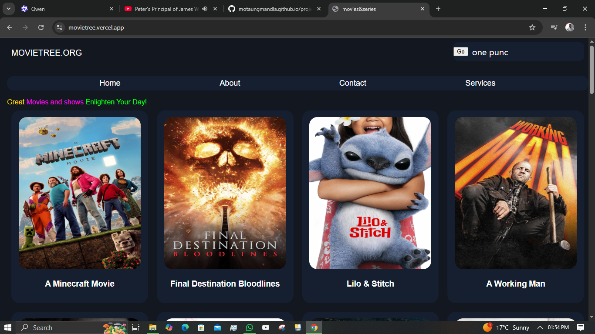

Movietree – A Movie Recommendation Web App
A lightweight, responsive movie recommendation web app that fetches data from The Movie Database (TMDb) API using JavaScript . The app is currently under development and aims to provide users with curated movie lists, search functionality, and personalized recommendations.

🧩 Features (So Far)
✅ Movie Search : Users can search for movies by title
✅ Dynamic Content : Loads movie posters and details directly from TMDb API
✅ Responsive UI : Clean layout designed for desktop and mobile views
✅ Modular JavaScript : Code structure allows easy expansion
🚧 In Progress : User ratings, filtering, and AI-based recommendations

🌐 How It Works
When the app loads, it makes a request to the TMDb API
It retrieves trending or popular movies based on genre, year, or user input
Displays them in an interactive card layout
Allows users to search and filter movies dynamically

const API_KEY = 'YOUR_TMDB_API_KEY';
const API_URL = 'https://api.themoviedb.org/3/search/movie?api_key= ' + API_KEY + '&query=';

async function searchMovies() {
    const query = document.getElementById('search-bar').value;
    const response = await fetch(API_URL + query);
    const data = await response.json();
    displayMovies(data.results);
}

function displayMovies(movies) {
    const container = document.getElementById('movie-container');
    container.innerHTML = '';
    
    movies.forEach(movie => {
        const posterUrl = movie.poster_path 
            ? `https://image.tmdb.org/t/p/w500 ${movie.poster_path}` 
            : 'fallback-image.png';

        container.innerHTML += `
            

                
                <h3>${movie.title}</h3>
                
Rating: ${movie.vote_average}

                
Release: ${movie.release_date}

            

        `;
    });
}

🛠️ Future Enhancements
Add user authentication to save favorites
Implement genre filters , release date sorting, and advanced search
Integrate local storage to remember user preferences
Build a recommendation engine using JS or Python backend
Add Sesotho language support for local accessibility
Deploy as PWA (Progressive Web App) for offline use

📷 Screenshot (You Can Insert Yours Here Later)
Once you take a new screenshot of your interface, insert it here. 

🙌 Contributing
Feel free to fork this project and submit pull requests!
If you'd like to add features like:

Login system
AI-powered recommendations
Mobile optimization
Let me know and I’ll help you build them!

📝 License
MIT License – see LICENSE for more details
