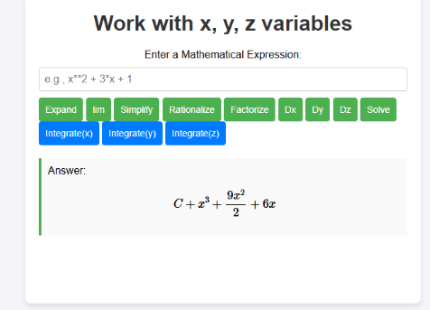

Algebraic calculators are essential tools in various fields such as mathematics, science, engineering, finance, and even everyday life. Here are some reasons why we need algebraic calculators:

<pre>
Efficiency: Algebraic calculators allow for quick and accurate calculations of complex algebraic expressions, equations, and functions. They can handle large numbers and intricate operations much faster than manual calculations, saving time and effort.

Versatility: Algebraic calculators can perform a wide range of mathematical tasks, including arithmetic operations, solving equations, graphing functions, calculating derivatives and integrals, and more. Their versatility makes them invaluable tools for students, professionals, and anyone needing to perform mathematical computations.

Problem-solving: Algebraic calculators enable users to solve a variety of mathematical problems efficiently. They provide step-by-step solutions, helping users understand the process and logic behind the calculations. This feature is particularly beneficial for students learning algebra, calculus, and other advanced mathematical concepts.

Accuracy: Algebraic calculators ensure accuracy in calculations, minimizing the risk of human error. They adhere to mathematical rules and formulas, eliminating calculation mistakes that could occur with manual methods. This reliability is crucial in fields where precision is paramount, such as engineering, finance, and scientific research.

Visualization: Many algebraic calculators come equipped with graphing capabilities, allowing users to visualize mathematical functions and equations. Graphs provide valuable insights into the behavior and properties of functions, helping users analyze data, identify patterns, and make informed decisions.

Accessibility: Algebraic calculators are widely available and accessible, with both physical handheld devices and software applications available for computers, smartphones, and tablets. This accessibility ensures that users can perform mathematical computations anytime, anywhere, making them indispensable tools for learning, work, and everyday tasks.
</pre>

Source: <a href="https://github.com/jogarces/ics-313-text-game"><i class="large github icon "></i>jogarces/ics-313-text-game</a>
